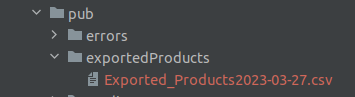

# Installation Guide : 

## 1. Clone repository to app/code/YellowCard folder.

## 2. You have to create in your /pub path new folder named : 

### "exportedProducts"

#### in this folder will be stored all exported files with purchased products.

## 3. Turn on the module, generate classes, upgrade database, and clear the cache
 * bin/magento module:enable YellowCard_ProductsExporter
 * bin/magento setup:di:compile
 * bin/magento setup:upgrade
 * bin/magento cache:clear
