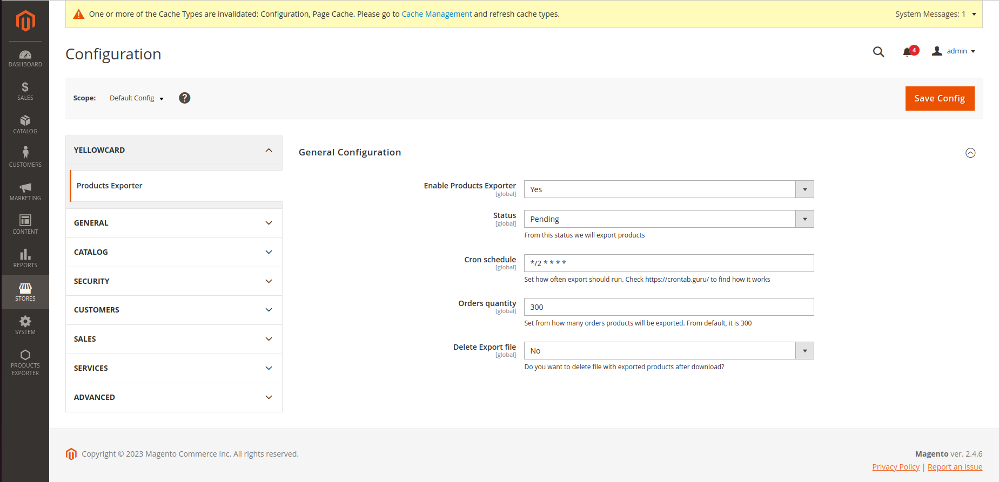
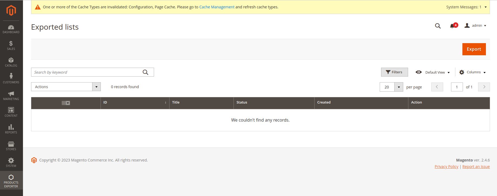
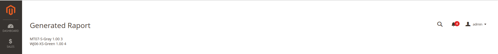
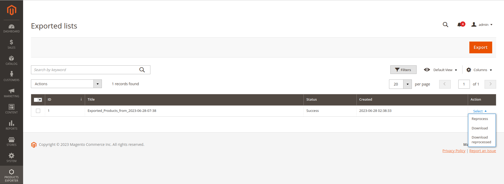
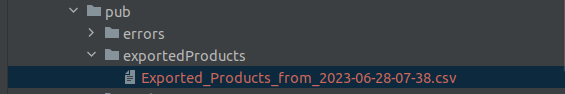
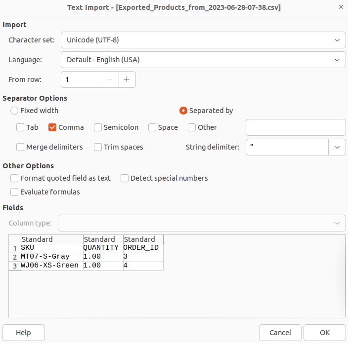
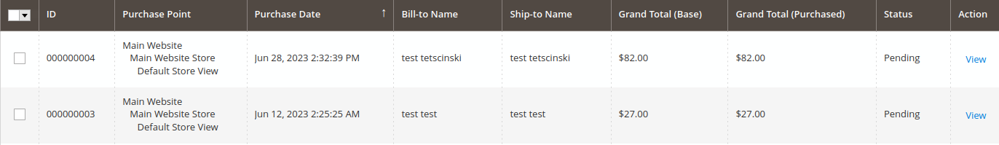
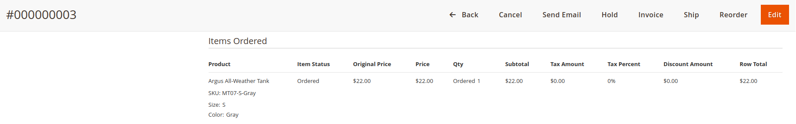
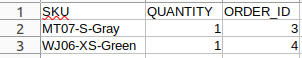

# Installation Guide : 

## 1. Clone repository to app/code/YellowCard folder.

## 2. You have to create in your /pub path new folder named : 

### "exportedProducts"

#### in this folder will be stored all exported files with purchased products.

## 3. Turn on the module, generate classes, upgrade database, and clear the cache
 * bin/magento module:enable YellowCard_ProductsExporter
 * bin/magento setup:di:compile
 * bin/magento setup:upgrade
 * bin/magento cache:clear

# Configuration Guide
### Go to stores -> configuration -> Yellowcard -> Products Exporter

## We have 5 sections : 
#### - Enable Products Exporter  
basically for turn on/off extension
#### - Status 
Here we have all available statuses in Magento system. we need to select one, so that orders having this status will be processed
#### - Cron schedule
Here we can set the time, when the export will be manually triggered by the system. It is in cron format. To know how it works, please see https://crontab.guru/
#### - Orders quantity 
here we can set maximum quantity of orders that we want to process in export
#### - Delete Export file 
here we can set, if after download of exported csv, we want to delete this file on the server

# Usage Guide
### If we have enabled our module, we can see new icon in left main sidebar

#### So go to it, then click Exported Lists, you will see grid below 

*from the beginning we will not have any exported files, so we do not see any rows in our grid*
 ## We have two ways of generating exports 
 ###  * Manually, by clicking Export button
 ### * By Cron 
#### - based on configuration, so how many, and with which status orders should be processed, export file will be generated. We will see new row in our listing. 
 *Only by manual generating the export, you will be redirected to an admin panel site, with a list of exported products. See screen below. We have to manually click again on products exporter icon to see the listing. Cron job do not show that products in admin, will only update listing with new row*
 

### After successfully created export, we can see on the listing one new row. By Clickng select we will be able to : 
#### - download csv file with exported products
#### - if the status is failed, or downloaded products is crashed, we can reprocess the csv. Module knows, from which orders raport has been generated, so even if you have changed statuses, raport will be generated from the same orders
#### - download reprocessed file

### Also in our path, we should see csv file /pub/exportedProducts/

### In downloaded file, columns are comma separated. After download from admin side our file with purchased products : 

#### File contains : 
- Sku - so which products to collect
- Quantity - how many was purchased
- Order ID - to which order te product belongs

In our case, two orders has been processed, in configuration 'Pending' status is set :

Each order, has only one product purchased, which we have in our exported csv file

---
KNOWN ISSUES -

Error when no orders with provided status

"Download reprocessed" downloads original file, reprocessed only on the server
Cron not tested

Cannot mass delete on export grid

Not tested for grouped, configurable and bundle products.

Api to be developed/checked
